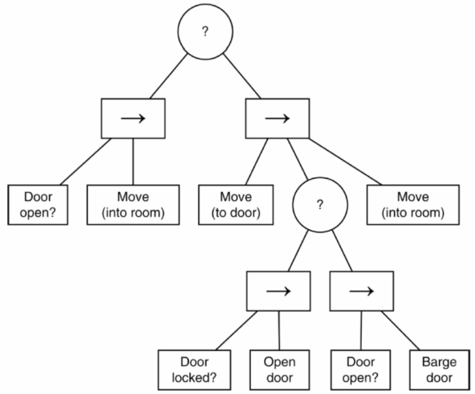
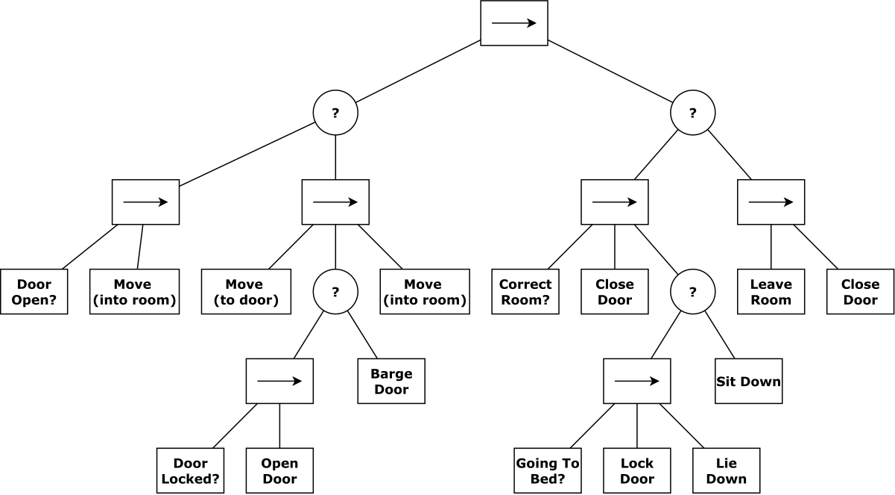
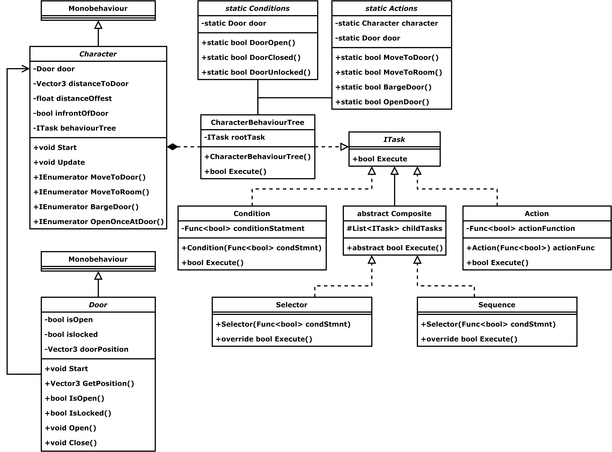

# BehaviourTree

### [Playable Link](https://bigelowd-cs450-ai.github.io/BehaviourTree/)

An implementation of Millington's Behvaiour Tree example

It does not imclude an implementation of his pseudocode, ust the behaviour tree he designed.

### Development Behaviour Tree Diagram

### Production Behaviour Tree Diagram

## Developoment Class Diagram
### Can't be bothered to redo for production, plus it would just get messy then

